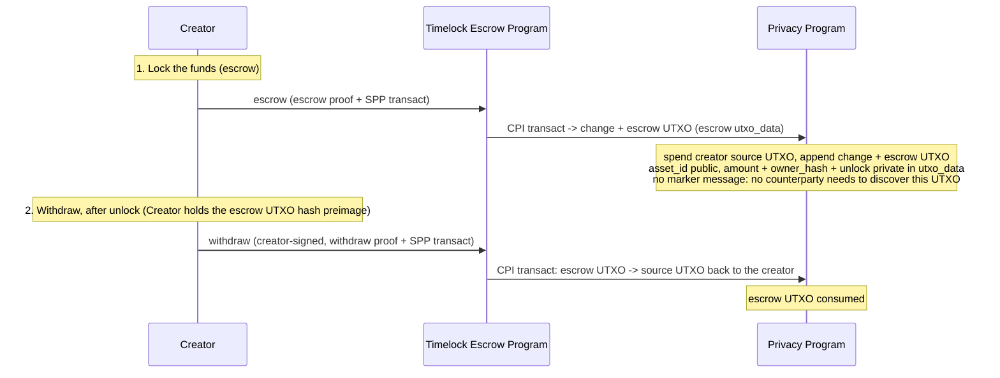

# Timelock Escrow Program

The timelock escrow program lets a creator lock funds as a shielded UTXO in the Solana Privacy
Program (SPP) with a chosen unlock timestamp, and reclaim them itself once that timestamp has
passed. The same creator that locks the funds is the only party that can withdraw them.

The timelock escrow program is an SPP ZK program: it verifies a small proof of its own escrow rules
and delegates the confidential transfer to SPP. It stores no state and owns no accounts.

This document specifies the escrow's privacy model, the escrow terms, the program's instructions,
and its circuits.

## Flow



## Table of Contents

- [Glossary](#glossary)
- [Privacy Model](#privacy-model)
- [Accounts](#accounts)
- [Escrow Terms](#escrow-terms)
- [Instructions](#instructions)
  - [escrow](#escrow)
  - [withdraw](#withdraw)
- [Circuits](#circuits)
  - [Escrow circuit](#escrow-circuit)
  - [Withdraw circuit](#withdraw-circuit)

## Glossary

Types used in this document. Shared SPP types are defined in [spec.md](../../docs/spec.md#glossary).

| Type | Encoding | Definition |
| --- | --- | --- |
| `Address` | `[u8; 32]` | Solana account address. |
| `asset_id` | `u64` | Asset identifier in UTXOs; `1` is SOL, each SPL mint `≥ 2`. The mint→`asset_id` map is the SPP `Asset registry` PDA. See [spec.md](../../docs/spec.md#glossary). |
| `CompressedShieldedAddress` | `[u8; 65]` | `(owner_hash [u8;32], viewing_pk P256Pubkey[33])`. See [spec.md](../../docs/spec.md#shielded-address). |
| `escrow UTXO` | — | The SPP [UTXO](../../docs/spec.md#utxo) holding the locked funds: `asset = asset_id`, `amount = amount`, `owner = escrow-authority PDA` (seeds `[b"escrow_authority"]`), nullifier secret `= 0`, `utxo_data = escrow terms`. Spendable only by the timelock escrow program. See [Escrow Terms](#escrow-terms). |
| `Escrow terms` | — | The fields committed in the escrow UTXO's `utxo_data` (record tag `0x02`), hashed into the escrow UTXO `utxo_hash` via `data_hash`: `owner_hash`, `unlock`. See [Escrow Terms](#escrow-terms). |
| `private_tx_hash` | `[u8; 32]` | Commitment to the SPP `transact` an escrow proof authorizes: the link between an escrow proof and the SPP transaction. See [spec.md](../../docs/spec.md#zk-program-interface). |
| `EscrowProof` / `WithdrawProof` | `[u8; 128]` | Groth16 proofs verified by the timelock escrow program, each committing the transaction via `private_tx_hash`. Both are standard Groth16: neither circuit does P256 elliptic-curve arithmetic (the creator authorizes with its own Solana transaction signature, checked by the runtime, not by the proof), so neither needs the extra commitment the P256 gadget requires. |
| `TransactIxData` | — | SPP `transact` instruction data: the SPP proof, input nullifiers, output UTXO hashes, ciphertexts, and routing. See [spec.md](../../docs/spec.md#transact). |
| `hash_field` | fn | `Poseidon` hash of a 32-byte value, folded into the field the circuits check over; used here to turn a Solana pubkey into a single value the proof can compare against a committed hash. |

## Privacy Model

What is public and what is private. The confidentiality is inherited from the SPP confidential
zone; the timelock escrow program does not try to hide which action ran.

- **Public:** which escrow instruction ran; `asset_id` at escrow and again at withdraw (`asset_id`s
  are SPP public inputs); the escrow UTXO hash at escrow; the escrow `unlock` timestamp, revealed at
  withdraw so the program can check it against the Clock; each transaction's SPP output UTXO hashes
  and ciphertexts; the creator's Solana signer pubkey, revealed at withdraw, which the creator signs.
- **Private:** `amount`, the locked value, and the aggregate volume per asset. These live only
  inside confidential UTXOs and the escrow UTXO `utxo_data`.
- **Unlinkable:** SPP hides the link between a created UTXO and its later spend, so an observer
  cannot pair an `escrow` call with its later `withdraw`.

## Accounts

The timelock escrow program owns no accounts: the locked funds live in the escrow UTXO, a leaf in
the SPP trees, moved by CPI. There is no rent-paying account to create or close, and no counterparty
compensation (unlike the swap program's taker spread) since the same creator both locks and later
reclaims the funds.

## Escrow Terms

The escrow UTXO holds the escrow terms and funds. `escrow` writes the escrow terms into the escrow
UTXO's `utxo_data` (record tag `0x02`), and SPP commits them into the escrow UTXO `utxo_hash`
through `data_hash` (committed unchecked, interpreted by the escrow circuit — see
[spec.md](../../docs/spec.md#utxo)):

```text
escrow_terms = (
    owner_hash,   // the creator's shielded owner hash: receives change at escrow and the withdrawal at withdraw
    unlock,       // unix seconds; revealed at withdraw and checked against the Clock by the program
)
data_hash = Poseidon(escrow_terms)        // enters the escrow UTXO utxo_hash directly
```

`asset_id`, `amount`, and `owner = escrow-authority PDA` are the escrow UTXO's own SPP fields,
already committed in `utxo_hash`. The escrow UTXO's owner is the escrow-authority PDA (seeds
`[b"escrow_authority"]`) and its nullifier secret is hardcoded to 0, so:

```text
escrow_utxo_owner_hash = Poseidon(hash_field(escrow_authority_pda), Poseidon(0))   // a program-wide constant
nullifier               = Poseidon(utxo_hash, blinding, 0)                          // recomputed from the preimage
```

Knowledge of the escrow UTXO hash preimage, the escrow terms plus the escrow UTXO `blinding`, is
the complete spend capability: the nullifier includes the `blinding` and the circuits need it to
recompute the escrow UTXO `utxo_hash`. There is no marker message and no discovery step: unlike the
swap program, there is no counterparty that needs to learn of this UTXO's existence, so the creator
fetches its own escrow note directly from the indexer later, using the escrow-authority PDA
or the known `utxo_hash` as the lookup tag. Moving the escrow UTXO also requires the program: SPP
spends a PDA-owned UTXO only when the timelock escrow program produces the escrow-authority signer
via `invoke_signed`, which it does only through `withdraw` (after unlock, creator-signed, to
`owner_hash`). The escrow circuits do not constrain the escrow UTXO owner value at all; SPP enforces
the PDA ownership at spend time, when the escrow UTXO input's owner must match the escrow-authority
signer.
The program derives the PDA via `find_program_address`, checks it is present among the forwarded
SPP accounts, and flips it to a signer inside the SPP CPI to authorize the escrow UTXO spend; the
PDA is a bare address and signs only inside the CPI.

`owner_hash` is the committed destination for both the change output at `escrow` and the refund at
`withdraw`: the creator recovers both from the escrow UTXO blinding it already holds. `withdraw`
requires the creator: it signs the withdraw transaction, and the withdraw proof checks `hash_field`
of the signer's pubkey against the escrow's `owner_hash`. The refund can only land at `owner_hash`.

`unlock` is a unix-seconds value the proof reveals as a public input and the timelock escrow
program checks against the Clock sysvar: `withdraw` requires `now > unlock`. `escrow` does not
check `unlock` against the Clock — an escrow created with an already-past unlock timestamp
only harms the creator. The proof's public `unlock` must equal the committed escrow term, so the
withdrawer cannot shift the window.

## Instructions

| # | Instruction | Tag | Description | Accounts Read | Accounts Modified | Access control |
|---|-------------|-----|-------------|---------------|-------------------|----------------|
| 1 | [escrow](#escrow) | 0 | Verify the escrow proof and CPI SPP `transact` to lock the source funds into the escrow UTXO (swap `utxo_data`). | — | SPP trees (CPI) | Creator signs (fee payer) |
| 2 | [withdraw](#withdraw) | 1 | Verify the withdraw proof and CPI SPP `transact`: after unlock, spend the escrow UTXO back to `owner_hash`. | escrow_authority | SPP trees (CPI) | Creator signs; the proof checks the signer against the committed `owner_hash`; the program's escrow-authority PDA authorizes the escrow UTXO spend |

---

### escrow

Locks funds. The timelock escrow program verifies the [escrow proof](#escrow-circuit), then CPIs
SPP [`transact`](../../docs/spec.md#transact) to spend the creator's `asset_id` UTXO and append the
escrow UTXO, a UTXO of `amount` `asset_id` owned by the escrow-authority PDA (seeds
`[b"escrow_authority"]`), with the [escrow terms](#escrow-terms) in its `utxo_data` (which, with
the PDA owner, makes SPP spend it only through an escrow circuit). The transact is 1-in/2-out (the
creator's source UTXO in; a change UTXO to the creator and the escrow UTXO out).

The proof checks the escrow UTXO output against the escrow rules (see the [escrow
circuit](#escrow-circuit)) without revealing the terms, and commits the transaction via
`private_tx_hash`, its sole public input. The amount and `unlock` are private at the escrow layer
(the transact's own `asset_id` public inputs still reveal `asset_id` at the SPP layer).

**Accounts**

1. `creator` — spends the source UTXO; signer, writable (fee payer). Consumed by the program;
   everything after it is forwarded verbatim to the SPP `transact` CPI.
2. `payer` — the SPP fee payer (the creator again); signer, writable.
3. `tree_accounts` — SPP trees the transact touches; writable.
4. `spp_program` — SPP program (CPI target); must be the last account (the program checks this).

**Instruction data**

```rust
struct EscrowIxData {
    /// The escrow proof; verified by the timelock escrow program against the transact's
    /// `private_tx_hash` as the sole public input.
    proof: EscrowProof,
    /// SPP transact (1-in/2-out): creator source UTXO -> change + escrow UTXO.
    transact: TransactIxData,
}
```

---

### withdraw

After unlock, the escrow UTXO is reclaimed to the committed `owner_hash`. The timelock escrow
program verifies the [withdraw proof](#withdraw-circuit), then CPIs SPP
[`transact`](../../docs/spec.md#transact). The transact is 1-in/1-out: the escrow UTXO in, an
`amount` `asset_id` UTXO to `owner_hash` out. The creator signs as a dedicated readonly signer; the
program includes `hash_field` of its pubkey in the proof's public input and the circuit checks it
against the committed `owner_hash`, so only the creator can withdraw, and the creator knows the
refund blinding it chose. The timelock escrow program supplies the escrow-authority PDA signer via
`invoke_signed` and reads the escrow `unlock` from the dedicated `unlock_timestamp` instruction-data
field and checks it against the Clock sysvar (`now > unlock`); the withdraw proof takes that same
value as a public input.

**Accounts**

1. `caller` — fee payer; signer, writable. Consumed by the program. `now` is read from the Clock
   sysvar via syscall.
2. `creator` — the creator's Solana signer; read-only, signer. Consumed by the program, which
   includes `hash_field(creator)` in the withdraw proof's public input; everything after it is
   forwarded verbatim to the SPP `transact` CPI.
3. `payer` — the SPP fee payer; signer, writable.
4. `tree_accounts` — SPP trees the transact touches; writable.
5. `escrow_authority` — escrow-authority PDA (seeds `[b"escrow_authority"]`); read-only,
   non-signer. The program flips it to a signer inside the SPP CPI to authorize the escrow UTXO
   spend (see [Escrow Terms](#escrow-terms)).
6. `spp_program` — SPP program (CPI target); must be the last account (the program checks this).

**Instruction data**

```rust
struct WithdrawIxData {
    /// The withdraw proof; verified by the timelock escrow program.
    proof: WithdrawProof,
    /// The committed escrow unlock timestamp, checked against the Clock (now > unlock) and a
    /// proof public input.
    unlock_timestamp: u64,
    /// SPP transact (1-in/1-out): escrow UTXO -> source UTXO to owner_hash.
    transact: TransactIxData,
}
```

## Circuits

The timelock escrow program runs two circuits, each with its own verifying key, distinct from the
SPP value proof inside `transact`. Each circuit takes the SPP transaction's UTXO hash preimages as
private inputs (the escrow UTXO input or output, the change/source output), enforces the escrow
rules below, and commits the transaction via `private_tx_hash`: `escrow` exposes it as the public
input itself, `withdraw` hashes it with its public values into a single public input. SPP proves
the UTXOs are in the tree and conserves value; the escrow circuits rely on that rather than proving
membership themselves. Both circuits are standard Groth16: neither does P256 elliptic-curve
arithmetic, so neither needs the extra commitment that gadget would require. Concrete shape
parameters (input/output slot counts) are fixed once and benchmarked, and must match the SPP
`transact` shapes the instructions use. The circuits are small and proven in-process through a
gnark→Rust FFI binding; the SPP transfer proof still comes from the existing SPP prover.

### Escrow circuit

Proves the escrow UTXO output commits the escrow terms. Matches the 1-in/2-out transact (source
UTXO in; change + escrow UTXO out), padded to the SPP `(2, 2)` proving shape.

- **Public inputs:** `private_tx_hash` only; the program feeds it to the verifier straight from
  `TransactIxData`.
- **Private inputs:** the escrow terms (`owner_hash`, `unlock`) and the escrow UTXO and change
  output UTXO hash preimages. The circuit does not constrain the escrow UTXO owner value (SPP
  enforces it is the escrow-authority PDA at spend time).
- **Constraints:**
  - The `private_tx_hash` recomputation mirrors the padded transact exactly: the input hash chain
    covers `[source_input, 0]`, the output hash chain covers `[change, escrow_utxo]`, and the
    address hash chain covers `[0, 0]` (see [private_tx_hash](../../docs/spec.md#spp-proof---solana-privacy-zk-proof)).
    The source input hash is supplied directly, not recomputed by the circuit; the change slot
    contributes 0 when the change amount is 0.
  - The escrow UTXO output committed in `private_tx_hash` has `data_hash = Poseidon(escrow terms)`,
    `zone_program_id = 0` and `zone_data_hash = 0` (the [default, non-zone](../../docs/spec.md#default-zone)
    UTXO variant), and a nonzero amount, so the public SPP escrow UTXO output commits the terms.
  - The change output is constrained to the escrow UTXO's asset and to `owner_hash`, with empty
    data.

### Withdraw circuit

Reclaims the escrow UTXO to the committed `owner_hash` after unlock. Matches the 1-in/1-out
transact (escrow UTXO in; source-to-owner out). The program enforces `now > unlock` against the
Clock; the circuit only reveals `unlock` and checks it equals the committed term.

- **Public inputs:** `Poseidon(private_tx_hash, unlock, owner_pk_field)`, where `owner_pk_field` is
  `hash_field` of the creator signer's pubkey, fed by the program.
- **Private inputs:** the escrow UTXO hash preimage (incl. `utxo_data` = escrow terms, `amount`,
  `escrow_utxo_blinding`), the `source_output` hash preimage, and the creator's `(owner_pk_field,
  nullifier_pk)`, the preimage of the committed `owner_hash`. The escrow UTXO owner is the
  escrow-authority PDA constant and the escrow UTXO preimage includes the `escrow_utxo_blinding`.
- **Constraints:**
  - The public `unlock` equals the committed escrow `unlock`.
  - `Poseidon(owner_pk_field, nullifier_pk)` equals the committed `owner_hash`, so the proof
    verifies only with the creator signer the program supplies.
  - The output committed in `private_tx_hash` is `source_output == (asset_id, amount,
    owner_hash)`.
