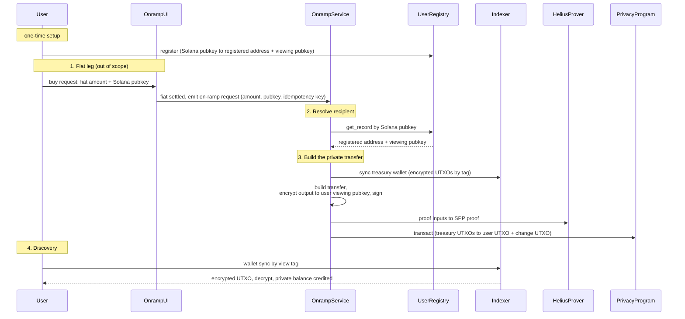
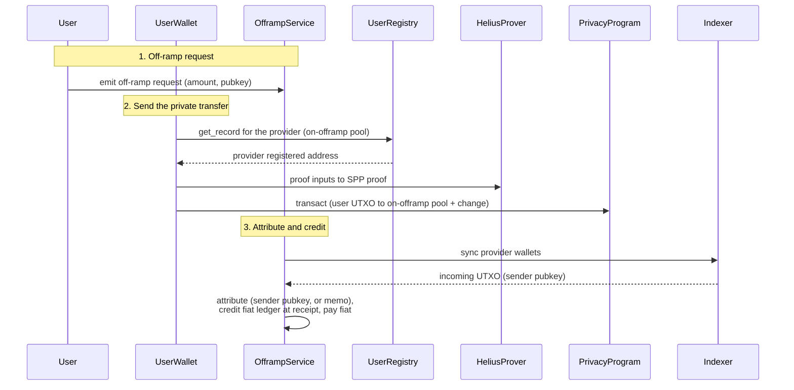
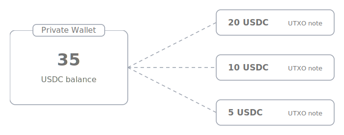
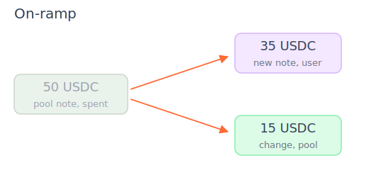

# Confidential Fiat On-Ramp and Off-Ramp

Users can onramp and offramp fiat balances directly to and from their confidential balance. Either direction needs no deposit to a public balance, hence does not reveal the asset and amount a user onramps to, or offramps from.

| Field | Visibility |
| --- | --- |
| On-offramp Asset  | Private |
| On-offramp Amount  | Private |
| User Wallet Address | Public |

### Prerequisites:

- The user has a private wallet.
- The provider (eg CEX or fiat-to-crypto processor such as MoonPay) holds a private balance of the asset for private on-offramps (SOL or any SPL / Token 2022 token, such as USDC). 
- Make sure the private on-offramp pool has a sufficient balance to serve your users, similar to public on-offramps.

### High-level Flows

On-ramp:

- The user transfers fiat to the provider.
- The provider records the purchase in its internal fiat ledger.
- The provider privately transfers from the private on-offramp pool to the user's private balance.

Off-ramp:

- The user privately transfers from their private balance to the provider's on-offramp pool.
- The provider credits the user's fiat balance in its internal ledger and pays out fiat.

## Terms

## Flow

The fiat leg depends on your internal ledger and varies. 
You can integrate client side the private on-offramps to the default privacy ring, or to a custom privacy ring.

### On-ramp request

The fiat leg emits one on-ramp request per settled purchase. It is an internal service message, not an
on-chain object.

```rust
struct OnrampRequest {
    /// USDC base units to deliver into the user's private balance.
    amount: u64,
    /// The user's Solana pubkey; the registry lookup key for the registered address.
    solana_pubkey: Address,
    /// Stable unique id from the fiat leg. The pipeline dedupes on it so a
    /// purchase settles exactly once across fiat-side retries and reconciliation.
    idempotency_key: [u8; 32],
}
```
If a request for `idempotency_key` already reached the `submitted` or `confirmed` state, 
it returns the initial transaction instead of retrying for another transfer.

### On-ramp 

On-ramp is a private transfer from the private on-offramp pool and follows these steps:

1. User deposits fiat
2. Provider matches user fiat deposit to private wallet in internal ledger.
3. Provider syncs private balance of the on-offramp pool to get its latest balance, then sends a private transfer to the users private wallet. 

Any confidential on-/offramp is a private transfer from the providers deposit pool to and from a users private balance. 




### Off-ramp 

Off-ramp is a private transfer from the user's private wallet to the on-offramp pool, similar to a crypto deposit to an exchange. The provider matches the deposit to a user in its internal ledger to pay out
fiat. 

The steps to complete a private offramp include:
1. User syncs her private balance and sends private transfer to the on-offramp pool of the provider.
2. Provider matches the private transfer to a user via her wallet address in its internal ledger to pay out fiat.

Alternatively, the transfer can carry a memo with a unique account tag, for example for
anonymous off-ramps where the public key is not visible.



### On-offramp Pool

The on-offramp pool is a private balance of the provider to serve on-offramps of users. It can be any asset you want to support for private onramps (SOL or any SPL / Token 2022 token, such as USDC).

 Make sure the pool has a sufficient balance to serve your users, similar to public on-offramps.
// TODO: ??? what amounts?? how are funds usually held in on off ramp


#### Funding the on-offramp pool

Funding the on-offramp pool is a deposit to a privacy ring from a public balance with a resulting
private balance. Users only interact with the on-offramp pool via private transfers, so their public balance is never exposed.

| Field | Visibility | Why |
| --- | --- | --- |
| Source public wallet | Public | The deposit is a normal public transfer into the ring |
| Asset | Public | The token entering the ring is visible onchain |
| Amount | Public | The deposited amount is visible onchain |
| Resulting private balance | Private | Once inside the ring, the pool balance is encrypted |
| User on-offramps | Private | Private transfers between pool and user private wallets |

#### Managing the on-offramp pool balance

The on-offramp pool balance is the private balance of a provider.
The private balance is the sum of all UTXOs (unspent transaction outputs) owned by a private wallet. 


 A private transfer takes existing
UTXOs as inputs, consumes them, and creates new outputs for the recipient and for the sender's
remaining balance. That's why the private balance of an on-offramp pool becomes fragmented over time:

For example, Alice wants to on-ramp 35 USDC and the pool holds a 50 USDC note. The transfer consumes the complete 50 USDC note and creates a 35 USDC note for Alice and a 15 USDC change note owned by the pool.



Now Bob wants to off-ramp 35 USDC of his 50 USDC balance, held as notes of 20, 20, and 10 USDC. The offramp spends all three notes and creates a 35 USDC note for the pool and a 15 USDC change note back to Bob. The pool balance is itself fragmented, into notes of 30, 12, and 44 USDC; the new 35 USDC note adds to it.


To make sure transaction capture the complete private balance (all UTXOs), it's recommended to merge UTXOs periodically. Transactions can only take a certain amount of UTXOs as input. This way, the on-offramp pool always has its entire balance available to server users.

There are two ways to unify the private balance:

1. **Self-consolidation.** The provider merges its own UTXOs with private transfers to itself. 
This can be done periodically, for example on a time basis, or when a certain amount of transactions interacted with the pool.
2. **Merge service.** The provider authorizes a merge service once to unify multiple UTXOs into one without requiring a signature per merge. A merge preserves owner, asset, and total amount and cannot spend funds.

## Reference implementation

This directory is also a runnable Rust crate implementing the operator flow above against devnet.
It creates a mintable test SPL token as the USDC stand-in; the mint and wallets are temporary
fixtures, while the ledger, attribution, idempotency, and treasury-lock behavior mirror the service
boundaries in this specification. 

Integration is purely client side.

| Example | Description |
| --- | --- |
| `onramp` | Default-deny registered on-ramp with explicit input locks and shaped submit. |
| `offramp_mode1` | Shared address with an encrypted per-UTXO account-tag memo. |
| `offramp_mode2` | Provider-controlled registered deposit address per user. |
| `treasury_ops` | Replenishment, denomination, self-consolidation, and merge service. |
| `scenario` | End-to-end on-ramp, both off-ramp modes, and treasury maintenance. |

### Configure and run

Copy `.env.example` to `.env`, set `API_KEY`, and optionally set `ZOLANA_PAYER_KEYPAIR` (the Solana
CLI wallet is the default). The payer must hold enough devnet SOL for fixture transactions.

```bash
cargo run --example onramp
cargo run --example scenario
```