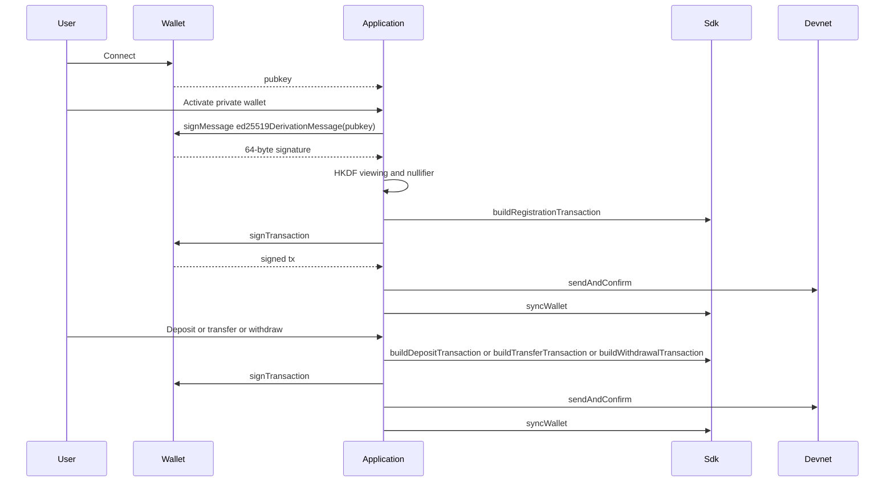

# Sign with Privy

Privy provides email login and an embedded Solana wallet. This example derives viewing and nullifier keys from one `signMessage` of `ed25519DerivationMessage(pubkey)`, then deposit, privately transfer, and withdraw on Helius devnet.

## User flow



## Run

Install Node.js 24+ and pnpm.

```bash
pnpm install
cp .env.example .env
# set VITE_API_KEY and VITE_PRIVY_APP_ID (public app ID only)
pnpm dev
```

Open the local Vite URL, sign in with Privy, and fund the embedded wallet on devnet. Connecting does not request a signature.

1. Connect the wallet, then choose **Activate private wallet**.
2. Approve the message. If the wallet is not registered, approve the registration transaction too.
3. After sync, inspect the public and private SOL balances.
4. Choose **Deposit**, **Transfer**, or **Withdraw**. Amounts remain fixed at 0.01, 0.003, and 0.003 SOL respectively. A transfer recipient must have an enabled private wallet; withdrawals return to the connected wallet.
5. Approve the transaction and follow the devnet explorer link. **Refresh balances** syncs without another message signature.

The first prompt is `signMessage` of `ed25519DerivationMessage(pubkey)` (its payload is `TSPP/derive/v1`). A wallet that refuses a leading `0xff` cannot complete this example; do not sign the payload bytes alone. Later prompts are `signTransaction`.

## Tests

```bash
pnpm test
# live devnet; needs API_KEY and a funded ~/.config/solana/id.json
pnpm test:integration
```

## Interface

One responsive wallet panel uses a system font, a clear balance hierarchy, grouped action controls, and one prominent action at a time. Controls have at least 44px hit areas, visible focus states, readable labels, and text status feedback. The address expands for inspection and can be copied. Account changes clear the current session and stop unfinished work before further signing or submission; an already broadcast transaction cannot be cancelled.

The design adapts Apple’s [Typography](https://developer.apple.com/design/human-interface-guidelines/typography), [Layout](https://developer.apple.com/design/human-interface-guidelines/layout), and [Buttons](https://developer.apple.com/design/human-interface-guidelines/buttons) guidance to a browser interface. The local Light Token wallet-adapter example informed the connection, address, balance, and receipt patterns.

## Validation and limitations

- `pnpm check`, `pnpm test`, and `pnpm build` run with Node 24+. Unit tests cover explicit signing, duplicate actions, rejection/retry, account changes, recipient validation, SOL formatting, and retaining confirmed receipts when balance sync fails.
- The connected layouts were visually inspected with test fixtures at 390px and 1440px widths. Fixtures are not part of the app. The live app's disconnected screen and wallet modal were also inspected.
- Real Privy message signing and registration succeeded. The registry account was checked on devnet against the connected address. Private balance sync then failed with `WALLET_SYNC: CLIENT_REQUEST: API_REQUEST`; deposit, private transfer, and withdrawal remain unverified. The CLI integration test does not establish browser-wallet success.
- Vite excludes the WASM hasher from dependency optimization and prebundles its CommonJS `bn.js` dependency. The hasher is a direct dependency so pnpm can resolve it from optimized SDK imports. Browser WASM initialization was verified. The build still reports the upstream fallback WASM URL warnings and the large embedded WASM bundle.
- Set the example's own `.env` before live use; Vite does not read the parent TypeScript client's `.env`. RPC, indexer, and prover endpoints are unchanged. Service availability and browser CORS restrictions can still prevent live use.

If a transaction confirms but the following sync fails, the app preserves its explorer link and requires a balance refresh before another transaction. If a wallet rejects the SDK derivation message, use a compatible wallet; the app never substitutes a different signing payload.
