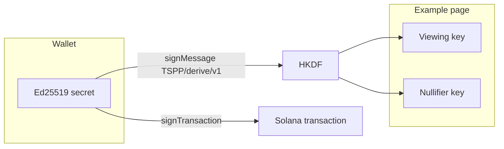
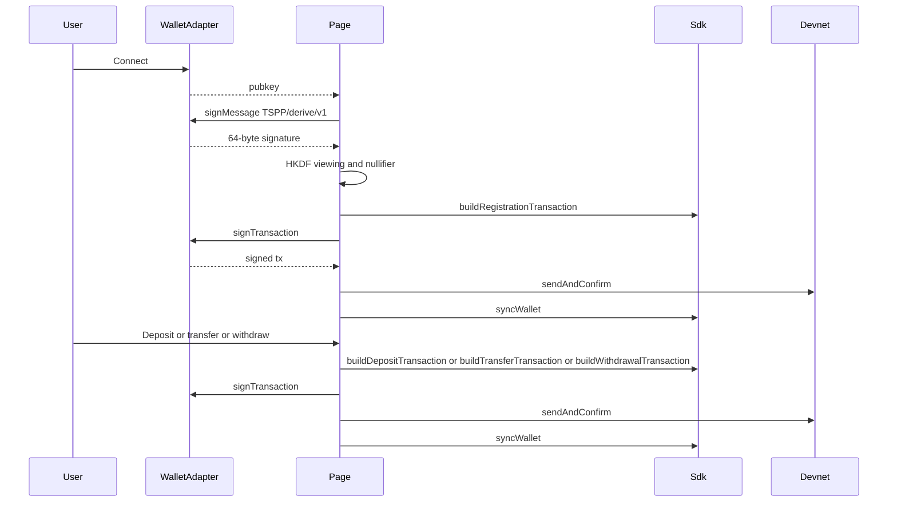
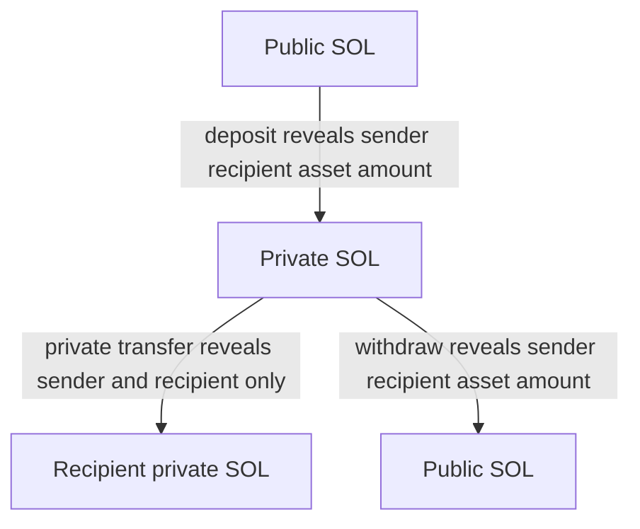

# Sign with Wallet Adapter

Wallet Adapter connects Phantom, Solflare, and other Wallet Standard wallets. This example derives viewing and nullifier keys from one `signMessage`, then deposit, privately transfer, and withdraw on Helius devnet. The wallet does not export the Ed25519 secret.

## What stays in the wallet



The signature over `TSPP/derive/v1` is the seed for viewing and nullifier keys. Reject any third-party request to sign that message.

## User flow



## Deposit, private transfer, withdraw



## Run

Install Node.js 24+ and pnpm.

```bash
pnpm install
cp .env.example .env
# set VITE_API_KEY
pnpm dev
```

Then connect a wallet funded on devnet. The first prompt is `signMessage`. Later prompts are `signTransaction`.

## Tests

```bash
pnpm test
# live devnet; needs API_KEY and a funded ~/.config/solana/id.json
pnpm test:integration
```
